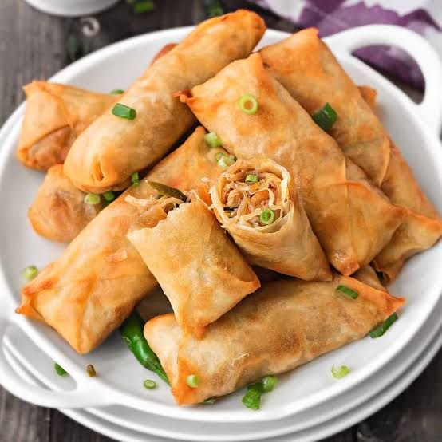

# Spring Rolls

## Description

A crispy and delicious appetizer filled with vegetables, popular across Asia.

## Ingredients

* 10 spring roll wrappers
* 1 cup cabbage, shredded
* 1 carrot, julienned
* 1/2 cup bean sprouts
* 2 green onions, chopped
* 2 cloves garlic, minced
* 2 tbsp soy sauce
* 1 tsp sesame oil
* Salt and pepper to taste
* Oil for frying

## Preparation Steps

1. Heat oil in a pan, sauté garlic for 30 seconds
2. Add cabbage, carrot, and bean sprouts — stir fry for 3-4 mins
3. Add soy sauce, sesame oil, salt and pepper — mix well
4. Let the filling cool completely
5. Place filling on a spring roll wrapper and roll tightly
6. Heat oil for frying, fry rolls until golden and crispy
7. Drain on paper towels and serve hot

## Cooking Time

* Preparation Time: 20 minutes
* Cooking Time: 15 minutes
* Total Time: 35 minutes

## Difficulty

Medium

## Servings

4 servings

## Image

## Author

Arnav Patil

## Serving Suggestion

Serve with sweet chilli sauce or soy dipping sauce.