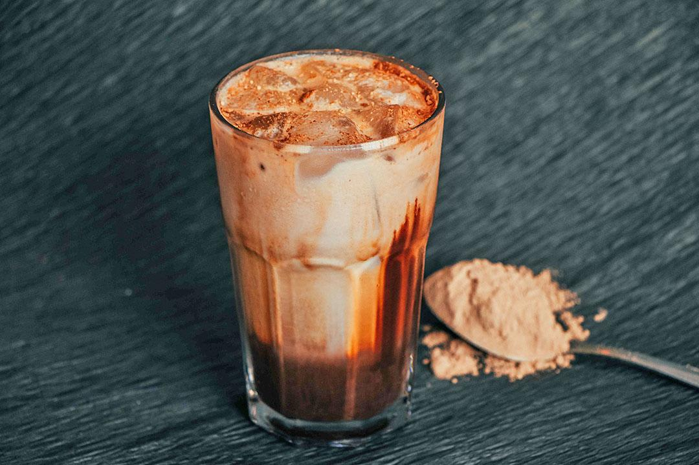

# Cold Coffee Recipe

## Description

A chilled, creamy and frothy coffee made with milk, instant coffee, sugar, and ice. Vanilla ice cream and chocolate toppings can be added for a richer and more indulgent drink.

## Ingredients

* 2 cups chilled milk
* 2 tsp instant coffee
* 2–3 tbsp sugar (adjust to taste)
* 1 cup ice cubes
* 1 tbsp vanilla ice cream *(optional, for a creamier texture)*
* 1 tsp cocoa powder or chocolate syrup *(optional, for garnish)*

## Preparation Steps

1. Add the chilled milk, instant coffee, sugar, and ice cubes to a blender.
2. Blend for **30–60 seconds** until smooth and frothy.
3. Add the vanilla ice cream (if using) and blend for another **10–15 seconds**.
4. Pour into chilled serving glasses.
5. Garnish with cocoa powder, chocolate syrup, or an extra scoop of ice cream.

## Cooking Time

* Preparation Time: 5 minutes
* Cooking Time: 0 minutes
* Total Time: 5 minutes

## Difficulty

Easy

## Servings

2 servings

## Image

## Author

Durvesh Thorat

## Tips

* Dissolve the instant coffee in **1 tbsp warm water** before blending for a stronger coffee flavor.
* Use less milk for a thicker consistency.
* Add **1 tbsp cocoa powder** for a mocha-style cold coffee.
* Replace sugar with honey or dates for a healthier alternative.
