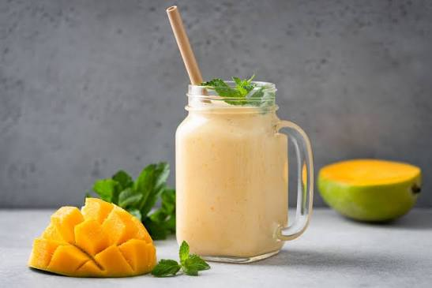

# Mango Lassi Recipe

## Description

A refreshing and creamy Indian yogurt-based drink made with ripe mangoes, yogurt, chilled milk, and sweetener. It can be flavored with cardamom and saffron and garnished with nuts for extra richness.

## Ingredients

* 1 cup ripe mango chunks (fresh or frozen)
* 1 cup plain yogurt (curd)
* 1/2 cup chilled milk
* 2 tbsp sugar or honey (adjust to taste)
* 4–5 ice cubes
* 1/4 tsp cardamom powder *(optional)*
* 1 tbsp chopped pistachios or almonds *(optional, for garnish)*
* A few saffron strands *(optional)*

## Preparation Steps

1. Peel and chop the ripe mango into small chunks.
2. Add the mango chunks, yogurt, chilled milk, sugar (or honey), and ice cubes to a blender.
3. Blend for **30–45 seconds** until smooth and creamy.
4. Add the cardamom powder and saffron (if using), then blend for another **5–10 seconds**.
5. Pour the mango lassi into chilled serving glasses.
6. Garnish with chopped pistachios or almonds.
7. Serve immediately while cold.

## Cooking Time

* Preparation Time: 5 minutes
* Cooking Time: 0 minutes
* Total Time: 5 minutes

## Difficulty

Easy

## Servings

2 servings

## Image

## Author

Durvesh Thorat

## Tips

* Use sweet, ripe mangoes such as Alphonso or Kesar for the best flavor.
* For a thicker lassi, reduce the milk or use Greek yogurt.
* For a vegan version, replace yogurt and milk with plant-based alternatives.
* Chill the glasses beforehand to keep the lassi colder for longer.
