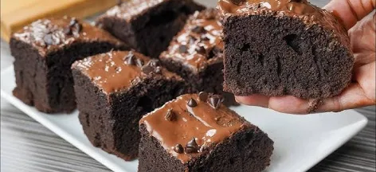

# Fudgy Chocolate Brownies

## Overview

Here is the structured breakdown of the recipe, categorized by ingredients, steps, timing, and skill level.

## Ingredients

- 1 cup unsalted butter (226g)
- 2 cups granulated sugar
- 3/4 cup unsweetened cocoa powder
- 3 large eggs (room temperature)
- 1 tbsp vanilla extract
- 1 tsp salt
- 1 cup all-purpose flour
- 1.5 cups semi-sweet chocolate chips

## Preparation Steps

1. Prep pan: Line an 8x8 inch square baking pan with parchment paper.
2. Melt butter: Heat butter in a microwave-safe bowl until completely liquid.
3. Whisk base: Whisk hot butter, sugar, and cocoa powder vigorously for 30 seconds.
4. Combine wet: Whisk in eggs, vanilla, and salt until the batter looks glossy.
5. Fold dry: Add flour and chocolate chips. Fold gently with a spatula.
6. Bake: Spread into the pan. Bake at 350°F (175°C) for 35 minutes.
7. Cool: Let brownies cool completely in the pan before slicing.

## Cooking Time

- Prep time: 15 minutes
- Bake time: 35–40 minutes
- Total time: 55 minutes

## Difficulty

Easy (Beginner-friendly)

## Equipment

No electric mixer required; needs only standard bowls and a spatula.

## Image

